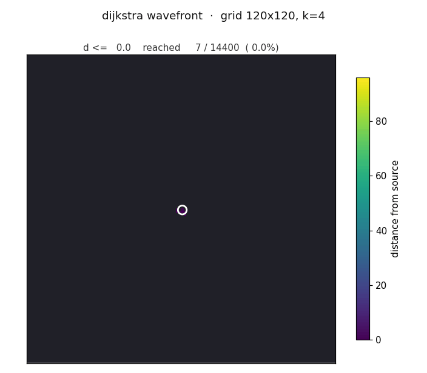

<h1 align="center">0&ndash;k BFS</h1>
<p align="center"><em>Bounded&nbsp;Integer&nbsp;Weights Shortest&nbsp;Path&nbsp;Problem &middot; C++17</em></p>

<p align="center">
  
</p>

<p align="center">
  <em>0&ndash;k BFS wavefront expanding from a centre source on a 120&times;120 grid, k = 4.<br/>
  Single-thread C++ -- the same code scales to <strong>V = 9&middot;10<sup>8</sup></strong> in 121&nbsp;s.</em>
</p>

<p align="center">
  
  
  
</p>

---

C++17 implementation and benchmarks of the 0&ndash;k BFS family of shortest-path
algorithms, compared against a Dijkstra baseline. Skoltech Algorithms&nbsp;2026
course project &mdash; **Artemov Makar, Mark Shkut**.

## Same answer, both algorithms

Dijkstra and 0&ndash;k BFS produce identical distance fields on every input
(byte-identical checksums on every cross-validated graph in the sweep). The
animation below shows Dijkstra exploring the very same grid -- the wavefront
looks the same; the difference is what is happening *inside* the data
structure (priority queue vs. k+1 FIFO buckets).

<p align="center">
  
</p>

## Under the hood: the k+1 circular FIFO queues

The pedagogical heart of 0&ndash;k BFS is that the priority queue is replaced
with $k+1$ plain FIFO queues indexed by $\mathrm{dist}[v] \bmod (k+1)$, and
a pointer `cur` that walks forward through them. The animation below runs
the algorithm step-by-step on a $10\times10$ grid with $k=3$: the left
panel shows the grid (vertex ids; colour = the bucket holding the current
copy of that vertex), and the right panel shows the actual contents of
$Q[0]\ldots Q[3]$ with the red `cur` arrow on the active bucket.

<p align="center">
  
</p>

What to watch for: (i)~each relaxation pushes the target into the bucket
chosen by `(new_dist) mod (k+1)`; (ii)~the active queue drains in FIFO
order; (iii)~when the active queue empties, `cur` advances and the next
bucket becomes active; (iv)~if a vertex is relaxed a second time to a
smaller distance, it lands in a different bucket and the older entry is
left as a stale slot to be skipped on pop.

## Headline result

On a 30&thinsp;000 &times; 30&thinsp;000 implicit grid
(V = 9&middot;10<sup>8</sup>, E = 3.6&middot;10<sup>9</sup>),
single-threaded 0&ndash;1 BFS finishes in **121&nbsp;s** vs Dijkstra's
**620&nbsp;s** &mdash; a **5.12&times;** speed-up with byte-identical
distance checksums.

| V                 | k | Dijkstra | 0&ndash;k BFS | 0&ndash;1 BFS | speed-up |
|------------------:|--:|---------:|--------------:|--------------:|---------:|
| 10<sup>6</sup>    | 1 | 0.180 s  | 0.039 s       | 0.070 s       | 4.6&times; |
| 10<sup>7</sup>    | 1 | 1.98 s   | 0.493 s       | 0.355 s       | 5.6&times; |
| 10<sup>8</sup>    | 1 | 60.3 s   | 28.4 s        | **5.44 s**    | **11.1&times;** |
| 4.84&middot;10<sup>8</sup> | 4 | 432.9 s | 451.4 s | &mdash; | 0.96&times; (mem-bound) |
| **9&middot;10<sup>8</sup>** | 1 | **619.9 s** | &mdash; | **121.2 s** | **5.12&times;** |

See [`stage1_report.pdf`](stage1_report.pdf) for the full writeup with
figures.

## Layout

```
include/zkbfs/   header-only algorithms and graph types
  common.hpp        Vertex / Weight / Distance, RunStats, Timer
  graph_csr.hpp     classical CSR graph
  grid_graph.hpp    implicit 4-neighbour grid (no edge storage)
  generators.hpp    ER, layered DAG, chain-with-chords
  dijkstra.hpp      priority_queue baseline
  bfs01.hpp         0-1 BFS via std::deque
  bfs0k.hpp         0-k BFS via k+1 circular queues
  bfs0k_trace.hpp   instrumented variant that emits per-event JSON
  json_out.hpp      stats serialization
src/
  main_bench.cpp    CLI benchmark runner (one JSON line per run)
  main_dump.cpp     dumps a graph + distances to JSON for viz
  main_trace.cpp    runs traced 0-k BFS, emits .events.jsonl + .meta.json
viz/
  run_pipeline.py     drives a parameter sweep
  visualize_dump.py   grid heatmap / node-link diagram
  plot_benchmarks.py  time-vs-V / time-vs-k plots
  report_figs.py      report-quality plots
  animate.py          wavefront GIF from a grid dump
  animate_queues.py   step-by-step queue-mechanic GIF from a trace
results/
  logs/          raw run logs (sweep.jsonl, scale_*, grid_headline)
  report_figs/   PNG figures + the three README animations
stage1_report.pdf    compiled Stage 1 report
project_plan.pdf     project plan
```

## Build (MSYS2 / ucrt64, g++ 15)

```bat
set PATH=C:\msys64\ucrt64\bin;%PATH%
g++ -std=c++17 -O3 -march=native -Iinclude src\main_bench.cpp -o build\zkbfs_bench.exe
g++ -std=c++17 -O3 -march=native -Iinclude src\main_dump.cpp  -o build\zkbfs_dump.exe
g++ -std=c++17 -O3 -march=native -Iinclude src\main_trace.cpp -o build\zkbfs_trace.exe
```

Or `make`. Or `cmake -S . -B build && cmake --build build`.

## Run

```bat
:: 45-config sweep + plots
python viz\run_pipeline.py    --bench build\zkbfs_bench.exe --out results\sweep.jsonl --quick
python viz\plot_benchmarks.py results\sweep.jsonl --outdir results\figs

:: Static visualization
build\zkbfs_dump.exe --graph grid --rows 80 --cols 80 --k 4 --algo bfs0k ^
                     --src 0 --out results\demo.json
python viz\visualize_dump.py results\demo.json

:: Wavefront animation (the top GIFs)
build\zkbfs_dump.exe --graph grid --rows 120 --cols 120 --k 4 --algo bfs0k ^
                     --src 7260 --out results\anim_grid.json
python viz\animate.py results\anim_grid.json --out results\report_figs\anim.gif

:: Multi-queue step-by-step animation
build\zkbfs_trace.exe --rows 10 --cols 10 --k 3 --src 0 --seed 12 --out results\trace_10x10
python viz\animate_queues.py results\trace_10x10 --out results\report_figs\queues.gif

:: Billion-vertex headline
build\zkbfs_bench.exe --graph grid --rows 30000 --cols 30000 --k 1 --algo bfs01
```

## Algorithms

|                    | data structure                | complexity            |
|--------------------|-------------------------------|-----------------------|
| `dijkstra_pq`      | `std::priority_queue` (lazy)  | O((V+E) log V)        |
| `bfs_01`           | `std::deque`                  | O(V + E)              |
| `bfs_0k`           | k+1 circular FIFO queues      | O(kV + E), mem O(k+E) |

All three are templated over a graph adapter, so the same code runs on the
`GridGraph` (implicit, scales to V&nbsp;&approx;&nbsp;10<sup>9</sup>) and on
the `GraphCSR` (classical edge-list, scales to V&nbsp;&approx;&nbsp;10<sup>8</sup>).
