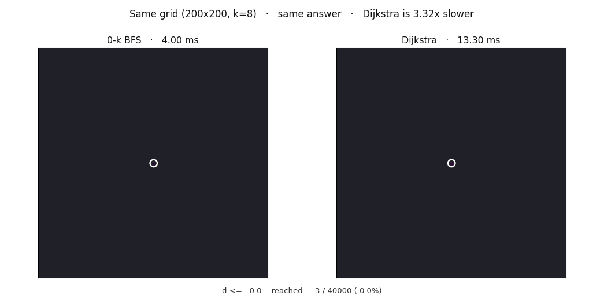
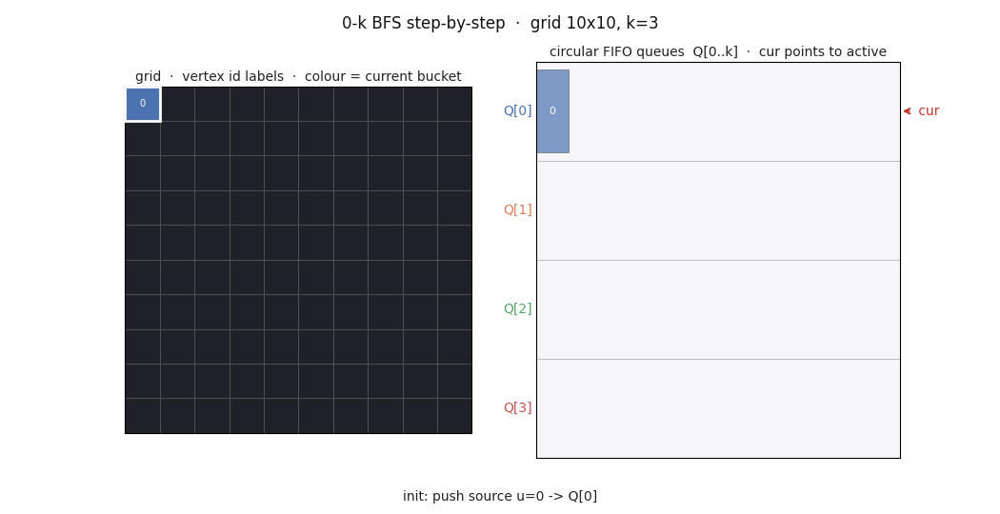
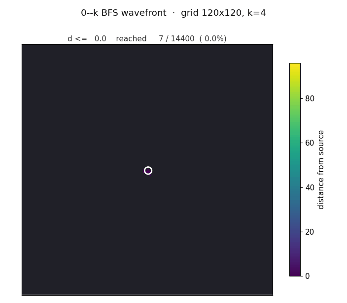
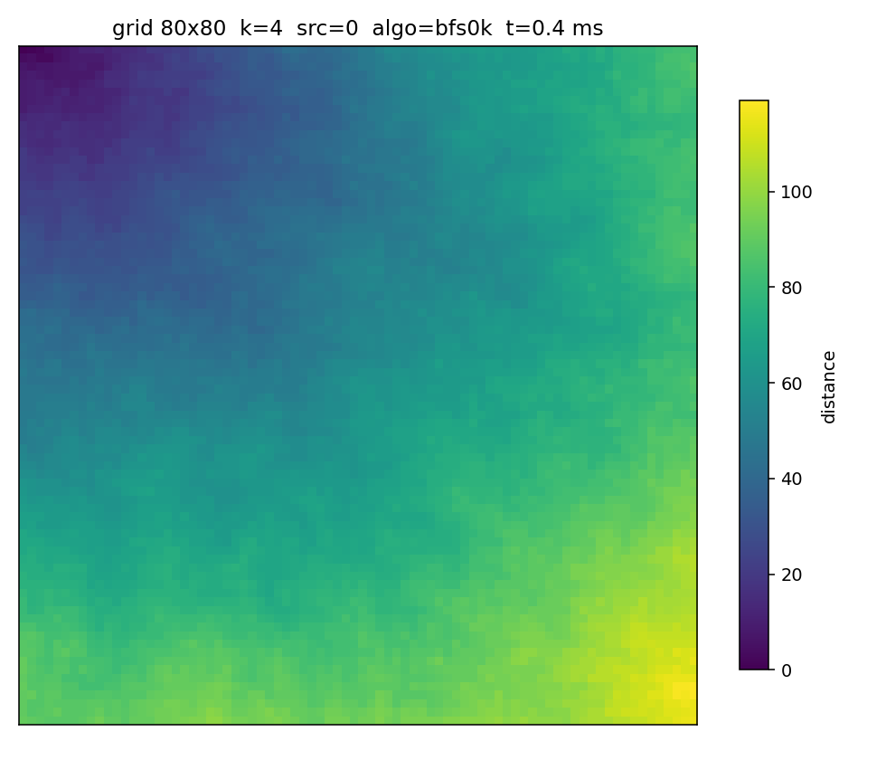
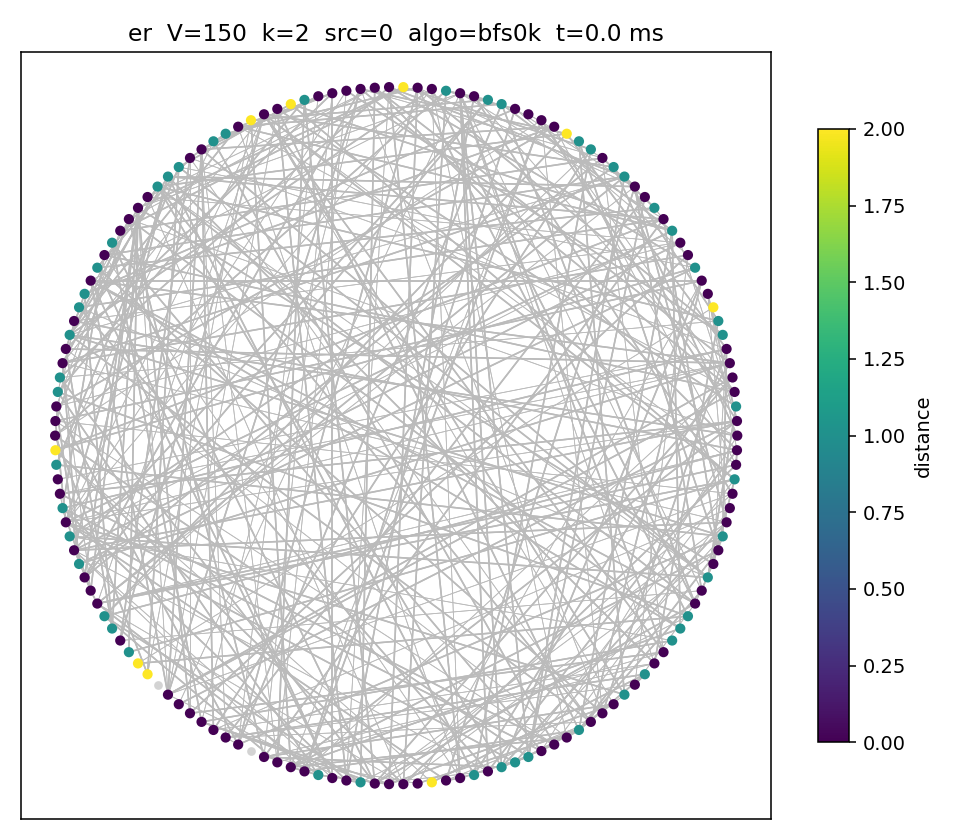
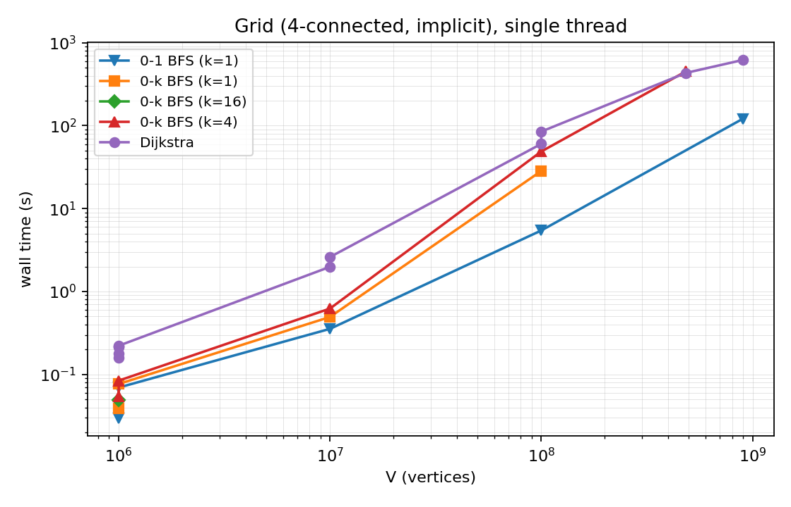
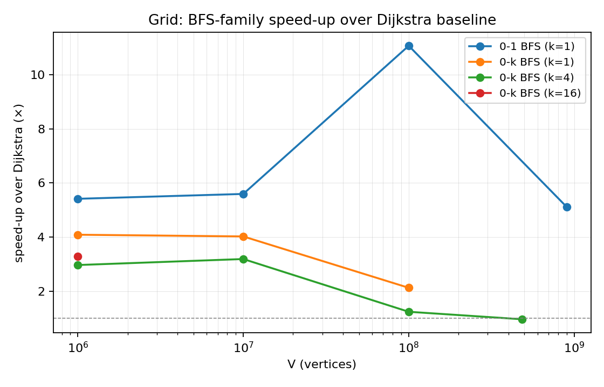

<!-- _class: lead -->
<!-- _paginate: false -->

# 0–k BFS

## Shortest Paths with Bounded Integer Weights

**Makar Artemov · Mark Shkut**
Skoltech · Algorithms 2026 · Stage 1

C++17 · implementation and benchmarks against Dijkstra

---

# Problem statement

**Single-Source Shortest Path** on a graph $G = (V, E)$ with weights $w : E \to \{0, 1, \dots, k\}$.

- $k$ — a small constant (4, 8, 16), known in advance
- classical Dijkstra: $O((V+E)\log V)$
- but with bounded weights we can do better: **$O(kV + E)$**

**Stage 1 goal:** build a C++17 implementation, compare against a Dijkstra baseline, and push the scale to $V \approx 10^9$ on a commodity workstation.

<div class="small">

Applications: road networks with quantised travel times, grid-based pathfinding in games and robotics, the BFS family for competitive programming.

</div>

---

# Headline result

<div class="center">



</div>

<div class="center small">

200×200 grid, $k=8$. Same distance field — but Dijkstra takes **3.32× longer** to get there.

</div>

---

# The big number

On an implicit **30 000 × 30 000** grid ($V = 9\cdot 10^8$, $E = 3.6\cdot 10^9$):

| Algorithm       | Wall time | Speed-up |
|-----------------|----------:|---------:|
| Dijkstra        |   619.9 s |    1.00× |
| **0–1 BFS**     | **121.2 s** | **5.12×** |

- single thread, commodity RAM (32 GB)
- byte-identical checksum: $1\,703\,472\,107\,894$
- $3.6 \cdot 10^9$ edge relaxations completed in **about two minutes**

<div class="small">

Trick: implicit graph (edges not materialised) + `uint32_t` for distances, since $k\cdot V < 2^{32}$.

</div>

---

# Three algorithms

| Algorithm       | Data structure                | Complexity             |
|-----------------|-------------------------------|------------------------|
| `dijkstra_pq`   | `std::priority_queue` (lazy)  | $O((V+E)\log V)$       |
| `bfs_01`        | `std::deque<Vertex>`          | $O(V + E)$             |
| `bfs_0k`        | $k+1$ circular FIFO queues    | $O(kV + E)$, memory $O(k+E)$ |

All three are templated over a graph adapter — the same code runs on:

- **`GridGraph`** — implicit 4-neighbour grid, no edge storage, up to $V \approx 10^9$
- **`GraphCSR`** — classical CSR, up to $V \approx 10^8$

---

# 0–1 BFS: a deque

For weights in $\{0, 1\}$ a single double-ended queue suffices:

```cpp
while (!dq.empty()) {
    Vertex u = dq.front(); dq.pop_front();
    if (dist[u] < cur_dist_of(u)) continue;   // stale
    for_each_neighbour(u, [&](Vertex v, Weight w) {
        Distance nd = dist[u] + w;
        if (nd < dist[v]) {
            dist[v] = nd;
            if (w == 0) dq.push_front(v);     // same frontier
            else        dq.push_back(v);      // next frontier
        }
    });
}
```

Invariant: the deque holds **at most two adjacent distance levels**.

---

# 0–k BFS: $k+1$ circular FIFOs

Idea: replace the priority queue with $M = k+1$ plain FIFO queues indexed by `dist[v] mod M`.

```cpp
std::vector<std::queue<Vertex>> Q(k + 1);
Q[0].push(src);
Distance cur = 0;
while (live > 0) {
    std::uint32_t idx = cur % M;
    while (Q[idx].empty()) { ++cur; idx = cur % M; }     // walk forward
    Vertex u = Q[idx].front(); Q[idx].pop();
    if (dist[u] != cur) continue;                        // stale slot
    g.for_each_neighbour(u, [&](Vertex v, Weight w) {
        Distance nd = cur + w;
        if (nd < dist[v]) { dist[v] = nd; Q[nd % M].push(v); }
    });
}
```

The `cur` pointer **only moves forward** — hence $O(kV + E)$.

---

# Queue mechanics, step by step

<div class="center">



</div>

<div class="small">

10×10 grid, $k=3$. Left: vertices (colour = bucket). Right: contents of $Q[0]\ldots Q[3]$, red arrow is `cur`.
A relaxation pushes the vertex into $Q[\text{newDist} \bmod (k{+}1)]$; stale entries (vertex already improved) are skipped on pop.

</div>

---

# 0–k BFS wavefront

<div class="center">



</div>

<div class="center small">

120×120 grid, $k=4$, source near the centre. The frontier looks like concentric distance rings — but without Dijkstra's $\log V$ overhead per pop.

</div>

---

# Datasets

Four generators with a seeded `std::mt19937_64`:

- **`grid`** — implicit 4-neighbour grid $r \times c$; weight $w(u,v) = (\text{terrain}[u] + \text{terrain}[v]) \bmod (k{+}1)$ → structured "mountains and valleys"
- **`er`** — Erdős–Rényi $G(n,p)$, weights uniform in $\{0..k\}$
- **`layered`** — DAG of $L$ layers, width $W$, fanout $F$
- **`chain`** — path of $n$ vertices + $c$ random chords (adversarial)

<div class="small">

All generators are deterministic given a seed. On the grid backend edges are computed on the fly — this is what unlocks $V \to 10^9$.

</div>

---

# Distance-field visualisation

<div class="center">

 

</div>

<div class="small">

**Left:** 80×80 grid, $k=4$, source at the corner — heatmap of distances shaped by random terrain.
**Right:** Erdős–Rényi $V=150, p=0.03, k=2$ — vertex colour encodes distance from the source.

</div>

---

# Scaling with $V$

<div class="center">

 

</div>

<div class="small">

**Left:** wall time vs $V$ (log–log). **Right:** BFS-family speed-up over Dijkstra. The 0–1 BFS peaks at **~11×** at $V = 10^8$, before memory pressure pulls it back.

</div>

---

# Results table (grid, 1 thread)

| $V$                 | $k$ | Dijkstra | 0–k BFS | 0–1 BFS | Speed-up |
|--------------------:|----:|---------:|--------:|--------:|---------:|
| $10^6$              |   1 | 0.180 s  | 0.039 s | 0.070 s | 4.6× |
| $10^7$              |   1 | 1.98 s   | 0.493 s | 0.355 s | 5.6× |
| $10^8$              |   1 | 60.3 s   | 28.4 s  | **5.44 s** | **11.1×** |
| $4.84\cdot 10^8$    |   4 | 432.9 s  | 451.4 s | —       | 0.96× (mem-bound) |
| $\mathbf{9\cdot 10^8}$ |   1 | **619.9 s** | — | **121.2 s** | **5.12×** |

Every distance array was cross-validated against Dijkstra — zero mismatches.

---

# Where it breaks: $k$ and memory

**1. Crossover in $k$.** At $V = 10^6$:
- $k=1$ → 4.6× speed-up
- $k=4$ → 4.1×
- $k=16$ → 3.3×

The asymptotic edge vanishes once $k = \omega(\log V)$.

**2. Memory-bandwidth ceiling.** At $V \gtrsim 5\cdot 10^8$ both algorithms become memory-bound: the queues alone are multi-GB structures (peak pushes $\approx 6\cdot 10^8$), and a cache-aware Dijkstra catches up.

**3. Deque vs $k+1$ queues.** At $V=10^8, k=1$ the deque variant runs in 5.44 s, the $k+1$-queue variant in 28.4 s. Same complexity — the gap is pure allocator/cache overhead.

---

# Repository layout

```
include/zkbfs/        header-only algorithms and graph types
  ├─ common.hpp         Vertex / Weight / Distance, RunStats, Timer
  ├─ graph_csr.hpp      classical CSR
  ├─ grid_graph.hpp     implicit grid (no edge storage)
  ├─ dijkstra.hpp       priority_queue baseline
  ├─ bfs01.hpp          0–1 BFS via std::deque
  └─ bfs0k.hpp          0–k BFS via k+1 circular FIFOs
src/
  ├─ main_bench.cpp     CLI benchmark runner → one JSON line per run
  ├─ main_dump.cpp      dumps a graph and distances for visualisation
  └─ main_trace.cpp     instrumented 0–k BFS → events.jsonl
viz/                    Python: sweep driver, plots, GIF animations
```

Build: `make`, or `cmake -S . -B build && cmake --build build`.

---

# Next steps (Week 2)

1. **Indexed 4-ary heap Dijkstra** — a fair baseline with real `decrease_key`
2. **Chunked ring-buffer FIFO** in `bfs_0k` — close the gap to the deque-based 0–1 BFS
3. **Real road network** — DIMACS USA, weights quantised to $k=8$
4. **Stretch:** $\Delta$-stepping for context (parallel-friendly)

<div class="small">

Already built-in: a 32-bit distance variant (valid when $k\cdot V < 2^{32}$) — this is exactly what lets $V = 9\cdot 10^8$ fit in 32 GB of RAM.

</div>

---

<!-- _class: lead -->
<!-- _paginate: false -->

# Thank you

## Questions?

<div class="small">

Repository: `EffectiveAlgorithms/`
Full report: `stage1_report.pdf`
**Makar Artemov · Mark Shkut** — Skoltech, Algorithms 2026

</div>
